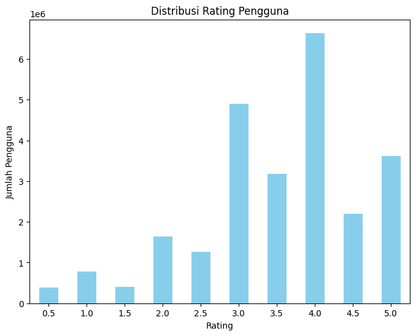
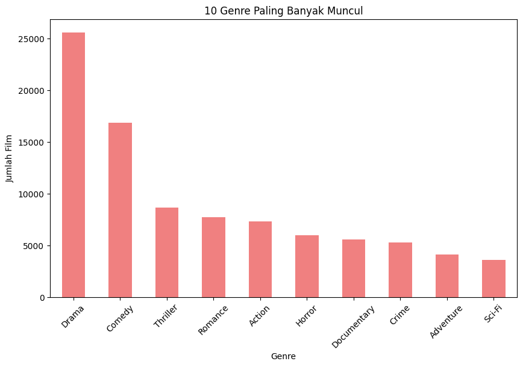

# Laporan Proyek Machine Learning - Gerin Sena Pratama

## Project Overview

Dalam era digital saat ini, sistem rekomendasi menjadi bagian penting dalam berbagai platform, seperti e-commerce, streaming, dan media sosial. Proyek ini bertujuan untuk mengembangkan sistem rekomendasi film menggunakan dua pendekatan utama: *content-based filtering* dan *collaborative filtering*. Dengan menyediakan rekomendasi yang lebih personal, proyek ini diharapkan dapat meningkatkan pengalaman pengguna dalam memilih film yang relevan.

Sistem rekomendasi film sering kali menggunakan dua metode utama, yaitu **content-based filtering** yang merekomendasikan item berdasarkan konten atau genre yang disukai pengguna, dan **collaborative filtering** yang mengandalkan interaksi pengguna lain untuk memberikan rekomendasi. Setiap metode memiliki kelebihan dan kekurangan, oleh karena itu pendekatan **hybrid** yang menggabungkan kedua metode ini dapat memberikan hasil yang lebih optimal dengan mengurangi kelemahan masing-masing metode.

Referensi: 
Hidayat Arfisko, Hilmi & Wibowo, Agung Toto. (2021). *Sistem Rekomendasi Film Menggunakan Metode Hybrid Collaborative Filtering Dan Content-Based Filtering.* Fakultas Informatika, Universitas Telkom, Bandung, Indonesia.

## Business Understanding

### Problem Statements
1. Bagaimana cara merekomendasikan film kepada pengguna berdasarkan preferensi genre mereka?  
2. Bagaimana cara merekomendasikan film kepada pengguna berdasarkan perilaku pengguna lain yang memiliki pola preferensi serupa?

### Goals
1. Mengembangkan sistem rekomendasi berbasis konten untuk memberikan rekomendasi berdasarkan genre film.  
2. Mengembangkan sistem rekomendasi berbasis kolaborasi untuk memberikan rekomendasi berdasarkan pola rating pengguna lain.

### Solution Statements
1. *Content-based filtering* menggunakan representasi fitur dari genre film.  
2. *Collaborative filtering* menggunakan pendekatan neural network untuk mempelajari hubungan antara pengguna dan film. Model ini memanfaatkan embedding layers untuk merepresentasikan pengguna dan film dalam ruang vektor berdimensi rendah, serta menghitung prediksi rating dengan mempertimbangkan interaksi antara pengguna dan film berdasarkan pola yang dipelajari selama pelatihan.

## Data Understanding

Data yang digunakan dalam proyek ini diambil dari Kaggle, yang berisi 2 file csv, yaitu movie dan rating. Dataset dapat diunduh melalui tautan berikut: [Movies Dataset](https://www.kaggle.com/datasets/parasharmanas/movie-recommendation-system).

### Informasi Data

#### 1. Movies Dataset
- **Jumlah Data:** Dataset ini memiliki 62423 baris dan 3 kolom.
- **Duplicate Values:** Dataset ini tidak mengandung data duplikat.
- **Missing Values:** Tidak terdapat missing values pada data.

#### 2. Ratings Dataset
- **Jumlah Data:** Dataset ini memiliki 25000095 baris dan 4 kolom.
- **Duplicate Values:** Dataset ini tidak mengandung data duplikat.
- **Missing Values:** Tidak terdapat missing values pada data.

### Variabel-variabel dalam dataset adalah sebagai berikut:

#### 1. Movies Dataset
Dataset ini berisi informasi tentang film yang ada dalam sistem rekomendasi, dengan kolom-kolom berikut:

- **movieId**: ID unik untuk setiap film dalam dataset.
- **title**: Judul film, yang juga mencakup tahun rilis dalam format tahun (misalnya "Toy Story (1995)").
- **genres**: Kategori atau genre dari film, yang dapat mencakup beberapa genre yang dipisahkan oleh tanda pemisah ("|"), seperti "Adventure", "Animation", "Comedy", dll.

#### 2. Ratings Dataset
Dataset ini berisi informasi mengenai rating yang diberikan oleh pengguna untuk setiap film. Kolom-kolom dalam dataset ini meliputi:

- **userId**: ID unik untuk setiap pengguna yang memberikan rating.
- **movieId**: ID film yang dirating oleh pengguna. Ini merujuk ke ID film di *Movies Dataset*.
- **rating**: Nilai rating yang diberikan oleh pengguna, biasanya dalam rentang 1 hingga 5, yang menggambarkan seberapa besar pengguna menyukai film tersebut.
- **timestamp**: Waktu atau timestamp ketika rating diberikan oleh pengguna, dalam format Unix timestamp.

### Exploratory Data Analysis
- Distribusi Rating: Sebagian besar pengguna memberikan rating di kisaran 3, 4, 5, serta rating yang lebih spesifik seperti 3.5 dan 4.5. Hal ini menunjukkan bahwa mayoritas rating yang diberikan pengguna memiliki nilai menengah hingga tinggi.



- Genre yang Paling Banyak Muncul: Genre yang paling banyak muncul adalah "Comedy" dan "Drama", yang menunjukkan preferensi pengguna terhadap film dengan tema komedi dan drama.



## Data Preparation

Langkah-langkah yang dilakukan:
1. Menghapus film yang tidak mempunyai genre atau *'no genres listed'*. 
```python
movies_data = movies_data[movies_data['genres'] != '(no genres listed)']
```
2. Melakukan undersampling, yaitu mengambil 10000 sample data secara acak.
```python
ratings_sampled = ratings_data.sample(n=10000, random_state=42)
```

Alasan dilakukan tahapan ini:  
- Menghapus data yang tidak mempunyai genre dikarenakan data tidak berpengaruh signifikan pada model.  
- Dikarenakan jumlah data yang cukup besar dan resource yang terbatas maka harus dilakuakan undersampling untuk mengurangi dimensi data dan menghemat memory.

## Modeling

Pada tahap ini, dua pendekatan utama digunakan untuk merekomendasikan film, yaitu **Content-Based Filtering** dan **Collaborative Filtering**. Setiap pendekatan memiliki metodologi dan implementasi yang berbeda, yang dijelaskan di bawah ini.

### 1. Content-Based Filtering

#### Tahapan dan Cara Kerja Content-Based Filtering
1. **Persiapan Data:** Menggunakan *TF-IDF Vectorizer* untuk mengubah genre film menjadi representasi vektor. Teknik ini mengonversi data teks (genre film) menjadi bentuk numerik yang dapat diproses oleh algoritma.
2. **Penghitungan Kesamaan:** Setelah data genre film diubah menjadi vektor, kesamaan antar film dihitung menggunakan *Cosine Similarity*. Ini mengukur sejauh mana dua film memiliki kesamaan dalam hal genre yang disukai pengguna.
3. **Rekomendasi Film:** Berdasarkan kesamaan tersebut, sistem merekomendasikan film yang memiliki genre serupa dengan film yang sudah disukai pengguna. Pendekatan ini sangat berguna untuk pengguna baru yang tidak memiliki banyak interaksi atau data riwayat penilaian.

#### Cara Kerja Content-Based Filtering
Content-based filtering merekomendasikan item berdasarkan informasi konten atau atribut film yang sudah diketahui (seperti genre). Keunggulannya adalah tidak memerlukan data pengguna lain, yang membuatnya ideal untuk situasi dengan sedikit data pengguna atau pengguna baru. Namun, pendekatan ini terbatas pada item yang telah diulas atau dinilai oleh pengguna.

### 2. Collaborative Filtering

#### Tahapan dan Cara Kerja Collaborative Filtering
1. **Neural Network-based Collaborative Filtering:**  
   Menggunakan pendekatan neural network untuk mempelajari hubungan antara pengguna dan film. Dalam model ini, digunakan *embedding layers* untuk merepresentasikan pengguna dan film sebagai vektor berdimensi rendah. Interaksi antara pengguna dan film dihitung dengan mengalikan vektor pengguna dan film, kemudian ditambahkan dengan bias pengguna dan film untuk mendapatkan prediksi rating.

2. **Pelatihan Model:**  
   Model ini dilatih menggunakan data interaksi pengguna dengan film (user-item interactions). Data ini diolah menjadi input untuk neural network, di mana jaringan belajar untuk memprediksi rating film berdasarkan pola perilaku pengguna yang serupa. Proses pelatihan ini menggunakan teknik optimasi seperti backpropagation untuk meminimalkan kesalahan prediksi.

3. **Rekomendasi Film:**  
   Setelah model dilatih, sistem dapat memberikan rekomendasi film berdasarkan preferensi pengguna lain yang serupa. Film yang belum pernah dinilai oleh pengguna akan diprediksi rating-nya, dan film dengan rating tertinggi akan direkomendasikan.

#### Cara Kerja Collaborative Filtering
Collaborative filtering dengan menggunakan neural network memanfaatkan data interaksi antar pengguna untuk memprediksi film yang mungkin disukai oleh pengguna yang belum memberikan rating untuk film tersebut. Teknik ini lebih efektif dalam menangkap pola-pola kompleks dalam data interaksi pengguna dan sering kali menghasilkan rekomendasi yang lebih personal dan relevan. Kelemahan dari metode ini adalah membutuhkan data yang cukup besar agar model dapat belajar secara efektif.

### Kelebihan dan Kekurangan

- **Content-Based Filtering:**
  - **Kelebihan:** Tidak memerlukan data interaksi pengguna lain, cocok untuk sistem rekomendasi baru atau pengguna baru (cold start problem).
  - **Kekurangan:** Rekomendasi terbatas pada film yang sudah dinilai atau ada dalam dataset, dan cenderung kurang beragam.

- **Collaborative Filtering:**
  - **Kelebihan:** Dapat memberikan rekomendasi yang lebih personal dengan memanfaatkan pola perilaku banyak pengguna.
  - **Kekurangan:** Memerlukan dataset besar dengan banyak interaksi pengguna untuk memberikan hasil yang baik.

## Evaluation

Metrik evaluasi yang digunakan dalam proyek ini adalah RMSE (Root Mean Square Error) dan MAE (Mean Absolute Error).

### Content-Based Filtering:
- **RMSE:** 2.5409  
- **MAE:** 2.3357  

### Collaborative Filtering:
- **RMSE:** 0.2613  
- **MAE:** 0.2111  

Hasil di atas menunjukkan bahwa model **Collaborative Filtering** memiliki performa yang jauh lebih baik dibandingkan **Content-Based Filtering**. Dengan RMSE yang lebih rendah, MAE yang lebih kecil, dan akurasi prediksi yang lebih tinggi, **Collaborative Filtering** dapat menangkap preferensi pengguna dengan lebih akurat.

---

### Penjelasan Formula Metrik

#### 1. RMSE (Root Mean Squared Error)

**Formula:**

$$
\text{RMSE}(y, \hat{y}) = \sqrt{\frac{\sum_{i=1}^{N} (y_i - \hat{y}_i)^2}{N}}
$$

**Penjelasan:**
- **$y$**: Nilai aktual (observasi nyata).
- **$ŷ$**: Nilai prediksi dari model.
- **$N$**: Jumlah data.
- **$(y_i - ŷ_i)$**: Selisih antara nilai aktual dan prediksi pada titik ke-i.
- **$(y_i - ŷ_i)²$**: Kuadrat dari selisih tersebut, untuk memastikan bahwa error negatif dan positif dihitung sebagai kesalahan.
- **$Σ (y_i - ŷ_i)²$**: Penjumlahan dari semua kuadrat kesalahan.
- **$N$**: Pembagi untuk mendapatkan rata-rata kesalahan kuadrat per data.
- **$√$**: Akar kuadrat untuk mengembalikan kesalahan ke skala aslinya.

**Cara Kerja:**  
RMSE mengukur seberapa besar perbedaan antara nilai prediksi dan nilai sebenarnya. Metrik ini memberikan penekanan lebih besar pada kesalahan yang besar karena kuadrat dari selisih. Nilai **RMSE yang lebih kecil** menunjukkan prediksi yang lebih akurat.

---

#### 2. MAE (Mean Absolute Error)

**Formula:**

$$
\text{MAPE} = \frac{1}{N} \sum_{i=1}^{N} \left|\frac{y_i - \hat{y}_i}{y_i}\right| \times 100
$$

**Penjelasan:**
- **$y$**: Nilai aktual (observasi nyata).
- **$ŷ$**: Nilai prediksi dari model.
- **$N$**: Jumlah data.
- **$|y_i - ŷ_i|$**: Nilai absolut dari perbedaan antara nilai aktual dan nilai prediksi.
- **$(y_i)$**: Nilai aktual pada titik ke-i.
- **$× 100$**: Menghitung persentase kesalahan.

**Cara Kerja:**  
MAE menghitung rata-rata selisih absolut antara nilai aktual dan prediksi. Nilai **MAE yang lebih kecil** menunjukkan model yang lebih akurat dalam memprediksi nilai.

---

### Kesimpulan Metrik:
- **RMSE** memberikan gambaran seberapa besar kesalahan rata-rata dalam satuan yang sama dengan data asli. Semakin kecil RMSE, semakin baik model.  
- **MAE** menunjukkan nilai deviasi rata-rata secara absolut. Metrik ini mudah dipahami dan memberikan indikasi akurasi prediksi.

Kedua metrik ini saling melengkapi untuk memberikan penilaian lengkap terhadap kualitas prediksi model.
